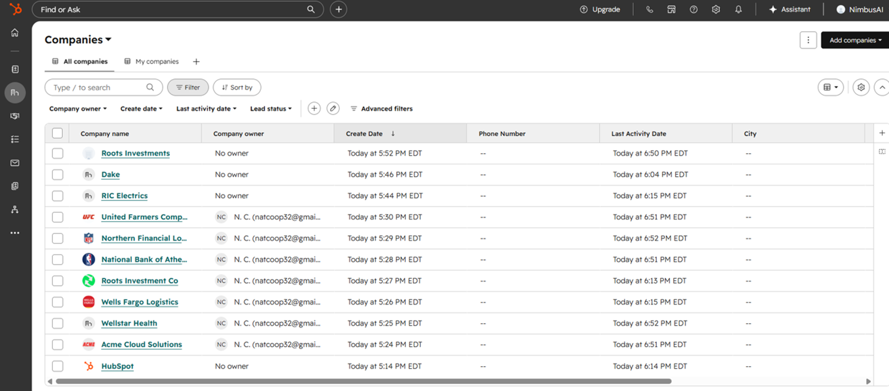
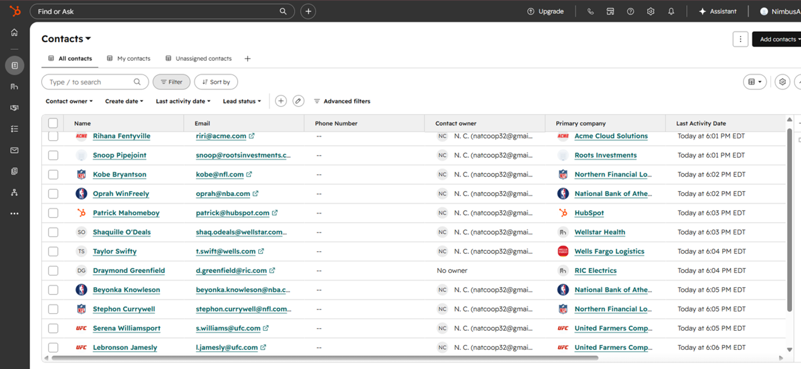
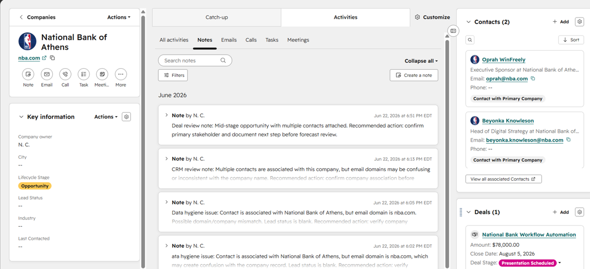
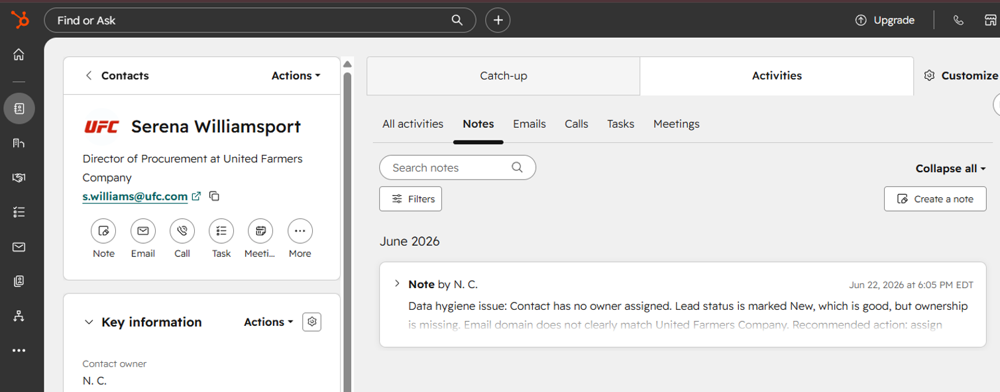
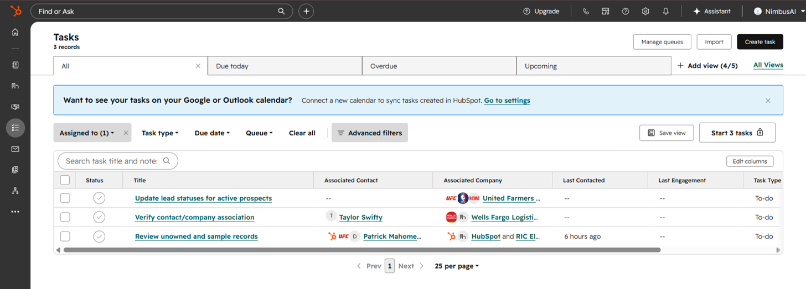
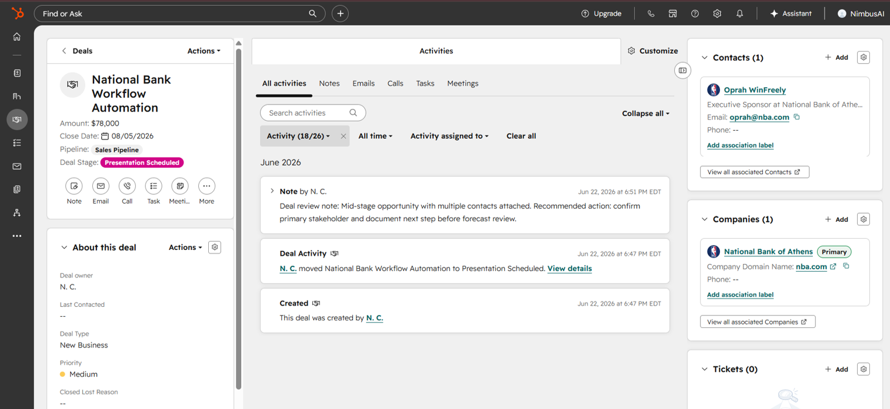
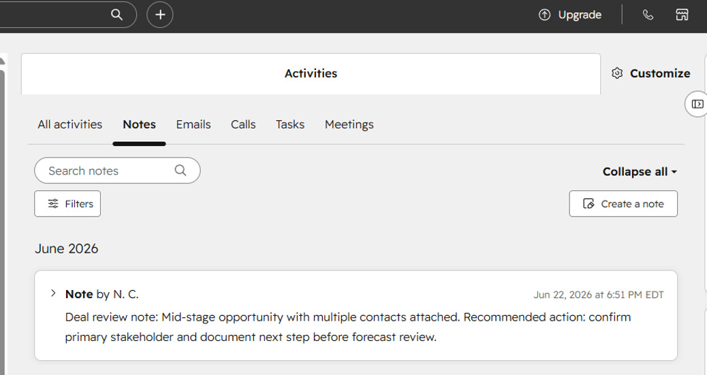
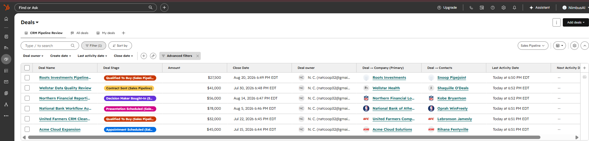
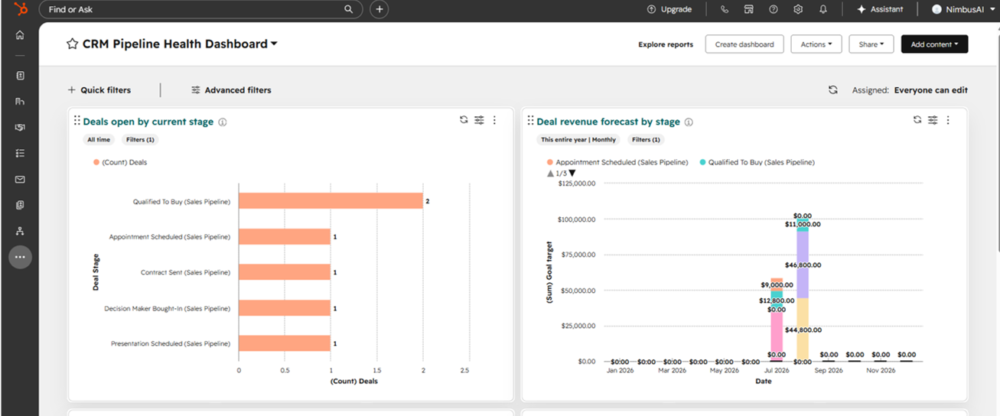
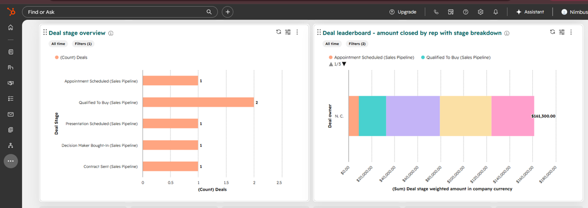

# HubSpot RevOps Pipeline Cleanup & MQL Handoff Review

## Executive Summary

Built a HubSpot RevOps workflow to clean up CRM records, review marketing-to-sales handoff issues, create follow-up tasks, organize active deals, build a saved pipeline review view, and create a dashboard for pipeline health and forecast visibility.

**Focus Areas:** CRM hygiene, MQL review, sales follow-up, deal pipeline visibility, dashboard reporting  
**Tools Used:** HubSpot CRM, HubSpot Deals, HubSpot Tasks, HubSpot Dashboards, GitHub  
**Output:** Cleaner CRM workflow, documented cleanup actions, saved pipeline view, and leadership-ready dashboard

## Real-World Revenue Operations Scenario

It’s Monday morning.

Marketing has been generating leads. Sales is asking which ones are actually worth following up on. Leadership wants a quick view of pipeline health before the next revenue meeting.

And HubSpot? HubSpot is sitting there like a junk drawer with a login screen.

Contacts exist. Companies exist. Deals exist. But the handoff from marketing to sales is not as clean as it should be. Some contacts are missing lead statuses. Some company/contact relationships need review. A few sample records are still hanging around like they pay rent. Deals are in the pipeline, but leadership does not have a clean view of what is open, what stage deals are in, or where forecasted revenue is sitting.

So I stepped in as the RevOps analyst to clean up the CRM, document data hygiene issues, create follow-up tasks, organize the pipeline, and build a HubSpot dashboard that connects marketing activity to sales visibility.

The goal was simple:

**Make the CRM easier to trust before leadership starts asking questions.**

---

## The Business Scenario

A growing B2B company was using HubSpot to manage contacts, companies, and sales opportunities.

Marketing had created or influenced several contacts that needed to be reviewed for sales readiness. Some contacts were early-stage leads. Some looked like they needed more qualification. Others had missing or messy CRM details that could create problems during sales follow-up.

Sales needed a cleaner way to answer:

* Which leads are ready for follow-up?
* Which contacts need cleanup before outreach?
* Which companies have active opportunities?
* Which deals are open?
* What stage is each deal in?
* How much revenue is sitting in the pipeline?
* What needs to be cleaned up before the next pipeline review?

This was not about making HubSpot look pretty.

It was about making HubSpot useful.

---

## Revenue Operations Problem

The CRM had several common marketing-to-sales handoff issues:

* Contact records had missing or inconsistent lead status values
* Some records needed clearer ownership
* Some contacts had questionable company associations
* Sample records were still mixed into the CRM
* Deal records needed clearer pipeline visibility
* Sales follow-up tasks were not clearly organized
* Leadership needed a dashboard to review open pipeline and forecasted revenue

In plain English:

Marketing had leads. Sales had questions. HubSpot had attitude.

---

## My Role

I acted as the RevOps analyst responsible for cleaning up the HubSpot workflow between marketing, sales, and pipeline reporting.

My work included:

* Reviewing contact records for lead status and ownership issues
* Reviewing company records for account-level hygiene issues
* Documenting messy CRM records with notes
* Creating cleanup tasks for follow-up
* Creating deal records tied to active companies and contacts
* Building a saved pipeline review view
* Creating a dashboard for pipeline health and forecast visibility
* Capturing screenshots to document the full workflow

---

## Tools Used

* HubSpot CRM
* HubSpot Contacts
* HubSpot Companies
* HubSpot Deals
* HubSpot Tasks
* HubSpot Notes
* HubSpot Saved Views
* HubSpot Dashboards
* GitHub for documentation

---

## CRM Foundation: Companies and Contacts

The workflow started by building the CRM foundation.

I created company and contact records to simulate a real marketing-to-sales environment. The contacts represented people who had entered the CRM and needed to be reviewed for sales readiness.

Some contacts were cleaner than others. Some had missing lead statuses. Some needed ownership assigned. Some had company associations that needed verification.

That is realistic. Real CRMs are rarely perfect. They are usually one rushed import away from chaos.

### Company Records

### Contact Records

---

## Marketing-to-Sales Data Hygiene Review

After the records were created, I reviewed the contact and company data for handoff issues.

The main question was:

**Can sales actually trust these records enough to follow up?**

I documented issues such as:

* Missing lead statuses
* Missing or unclear ownership
* Contact/company mismatches
* Records needing qualification review
* Sample/demo contacts that should not be included in active reporting
* Accounts needing additional cleanup before pipeline review

This step matters because bad CRM data creates bad sales follow-up.

If marketing passes over messy leads and sales does not know what to do with them, the funnel gets clogged. Then everybody starts blaming the dashboard, the lead source, the sales reps, Mercury in retrograde — everything except the CRM hygiene.

### Company Hygiene Note Example

### Contact Hygiene Note Example

---

## Cleanup Task Workflow

After identifying the CRM issues, I created follow-up tasks.

The tasks focused on:

* Verifying contact and company associations
* Reviewing unowned and sample records
* Updating lead statuses for active prospects

This turned the CRM review into an actual action plan.

Instead of just saying, “The data is messy,” I created a workflow for what needed to happen next.

### CRM Cleanup Task List

---

## Deal Creation and Pipeline Setup

Once the contact and company records were reviewed, I created active deal records across multiple pipeline stages.

The goal was to connect the marketing/sales handoff to actual pipeline visibility.

The deals helped show:

* Which companies had active opportunities
* Which stage each opportunity was in
* How much revenue was tied to each opportunity
* Which owner was responsible
* Which deals needed follow-up before forecast review

This made the workflow feel less like “random contacts in HubSpot” and more like a real revenue process.

Marketing creates interest. Sales works the opportunity. RevOps makes sure the system does not turn into soup.

### Deal Record Example

### Deal Review Note

---

## Pipeline Review View

I created a saved view called:

**CRM Pipeline Review**

This view gave sales and leadership a clean table of active opportunities.

The view included key fields such as:

* Deal name
* Deal stage
* Amount
* Close date
* Deal owner
* Associated company
* Associated contact
* Last activity date
* Next activity date

This saved view acts like the working table behind the dashboard.

The dashboard shows the story.
The saved view shows the actual records.

### CRM Pipeline Review Deal View

---

## Dashboard Build

After the records, tasks, and pipeline view were created, I built a HubSpot dashboard called:

**CRM Pipeline Health Dashboard**

The dashboard was designed to help leadership quickly understand:

* How many deals are open
* What stages the deals are in
* Where forecasted revenue is sitting
* Which deals or reps need attention
* Whether the pipeline is ready for review

The dashboard included reports for:

* Open deals by current stage
* Forecasted revenue by stage
* Deal stage overview
* Deal leaderboard / revenue breakdown

This gave leadership a cleaner revenue view without manually opening every deal record.

Because nobody wants a pipeline meeting where the answer to every question is, “Let me click into that.”

### Dashboard: Pipeline Stage and Forecast

### Dashboard: Stage Overview and Leaderboard

---

## What I Built

By the end of the workflow, I had built:

* A structured company database
* A contact list reviewed for lead status and ownership issues
* CRM hygiene notes for company and contact records
* Cleanup tasks for sales follow-up
* Six active deal records across multiple pipeline stages
* A saved CRM Pipeline Review view
* A HubSpot CRM Pipeline Health Dashboard
* Screenshot documentation showing the full workflow

In plain English:

I turned a messy HubSpot setup into a cleaner marketing-to-sales pipeline workflow.

---

## Business Impact

This workflow improved revenue visibility in several ways.

### Cleaner Marketing-to-Sales Handoff

Contacts were reviewed for lead status, ownership, and company alignment so sales could better understand which records needed follow-up.

### Better CRM Hygiene

Messy records were documented through notes instead of being ignored.

### Clearer Sales Follow-Up

Cleanup tasks gave the team specific next steps instead of leaving issues buried inside the CRM.

### Stronger Pipeline Visibility

Deals were organized by stage, amount, close date, and owner.

### Better Forecast Readiness

The dashboard helped leadership quickly see open pipeline and forecasted revenue.

### More Trustworthy Reporting

The saved view and dashboard made HubSpot easier to use for pipeline review.

Because a CRM dashboard is only helpful if the data underneath it is not acting suspicious.

---

## Key Takeaways

This project demonstrates how I would approach a real RevOps workflow inside HubSpot:

* Review CRM records before trusting the dashboard
* Identify marketing-to-sales handoff issues
* Document data hygiene problems clearly
* Create cleanup tasks tied to actual records
* Build deal records that support pipeline reporting
* Create saved views for operational review
* Build dashboards for leadership visibility
* Turn messy CRM activity into a cleaner revenue workflow

---
## What This Shows

This project shows practical RevOps skills that translate directly into real sales and marketing operations work:

- CRM record cleanup and organization
- Marketing-to-sales handoff review
- Lead status and ownership review
- Pipeline creation and deal tracking
- Sales follow-up task management
- Saved view creation for operational workflows
- Dashboard reporting for leadership visibility
- Clear documentation of business process and outcomes

  
## Summary

This HubSpot RevOps project shows how CRM cleanup, MQL-style lead review, sales follow-up, and pipeline reporting all connect.

The work was not just about creating contacts, companies, and deals.

It was about answering the real business question:

**Can marketing and sales trust the CRM enough to take action?**

After cleanup, the answer is much closer to yes.

The CRM became easier to review, easier to explain, and easier to use in a pipeline meeting.

And that is the whole point of RevOps:

**Clean the data. Clarify the process. Help the team know what to do next.**

